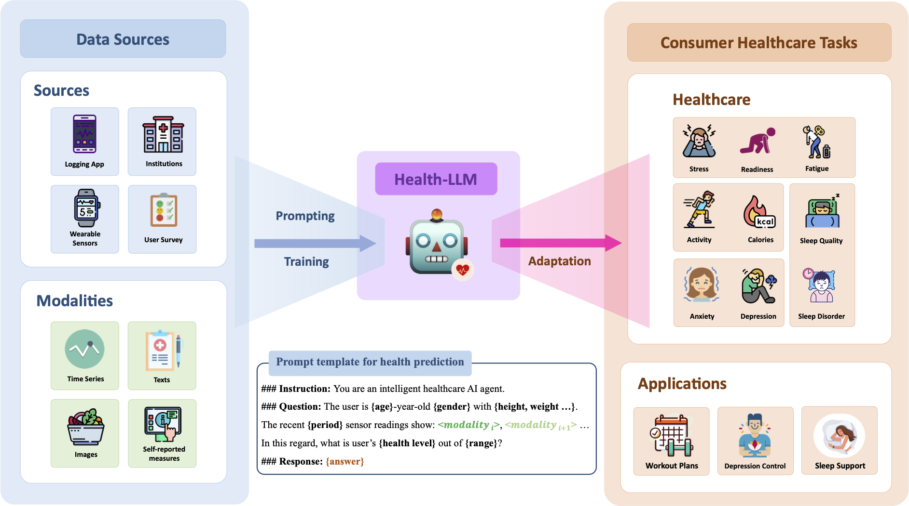

## Health-LLM: Large Language Models for Health Prediction via Wearable Sensor Data (CHIL 2024)

Large language models (LLMs) are capable of many natural language tasks, yet they are far from perfect. In health applications, grounding and interpreting domain-specific and non-linguistic data is important. This paper investigates the capacity of LLMs to make inferences about health based on contextual information (e.g. user demographics, health knowledge) and physiological data (e.g. resting heart rate, sleep minutes). We present a comprehensive evaluation of 12 publicly accessible state-of-the-art LLMs with prompting and fine-tuning techniques on four public health datasets **(PMData, LifeSnaps, GLOBEM and AW_FB)**. Our experiments cover 10 consumer health prediction tasks in mental health, activity, metabolic, and sleep assessment. Our fine-tuned model, HealthAlpaca exhibits comparable performance to much larger models **(GPT-3.5, GPT-4 and Gemini-Pro)**, achieving the best or second best performance in **7 out of 10** tasks. Ablation studies highlight the effectiveness of context enhancement strategies. Notably, we observe that our context enhancement can yield up to **23.8%** improvement in performance. While constructing contextually rich prompts (combining user context, health knowledge and temporal information) exhibits synergistic improvement, the inclusion of health knowledge context in prompts significantly enhances overall performance.

<p align="center">
  
</p>

<br>

## Quick Start

Create a new virtual environment, e.g. with conda

```bash
~$ conda create -n healthllm python>=3.9
```


Install the required packages:
```bash
~$ pip install -r requirements.txt
```

Activate the environment:
```bash
~$ conda activate healthllm
```

<br>

**Datasets**

1) PMData: [https://datasets.simula.no/pmdata/](https://datasets.simula.no/pmdata/)
2) LifeSnaps: [https://github.com/Datalab-AUTH/LifeSnaps-EDA](https://github.com/Datalab-AUTH/LifeSnaps-EDA)
3) GLOBEM: [https://physionet.org/content/globem/1.1/](https://physionet.org/content/globem/1.1/)
4) AW_FB: [https://dataverse.harvard.edu/dataset.xhtml?persistentId=doi:10.7910/DVN/ZS2Z2J](https://dataverse.harvard.edu/dataset.xhtml?persistentId=doi:10.7910/DVN/ZS2Z2J)

<br>

## Fine-tune

```bash
~$ bash finetune.sh
```

> [!TIP]
> Feel free to change the base model (--model) from ``medalpaca/medalpaca-{7,13}b`` to ``llama-{7,13}b-bf``.
> If you need to change the training details, please refer to ``./medalpaca/train.py``

<br>

## Inference

```bash
~$ python3 inference.py --model {gpt-3.5, gpt-4, gemini-pro, healthalpaca}
```

<br>

If our work is helpful to you, please kindly cite our paper as:

```
@misc{kim2024healthllm,
      title={Health-LLM: Large Language Models for Health Prediction via Wearable Sensor Data}, 
      author={Yubin Kim and Xuhai Xu and Daniel McDuff and Cynthia Breazeal and Hae Won Park},
      year={2024},
      eprint={2401.06866},
      archivePrefix={arXiv},
      primaryClass={cs.CL}
}
```

